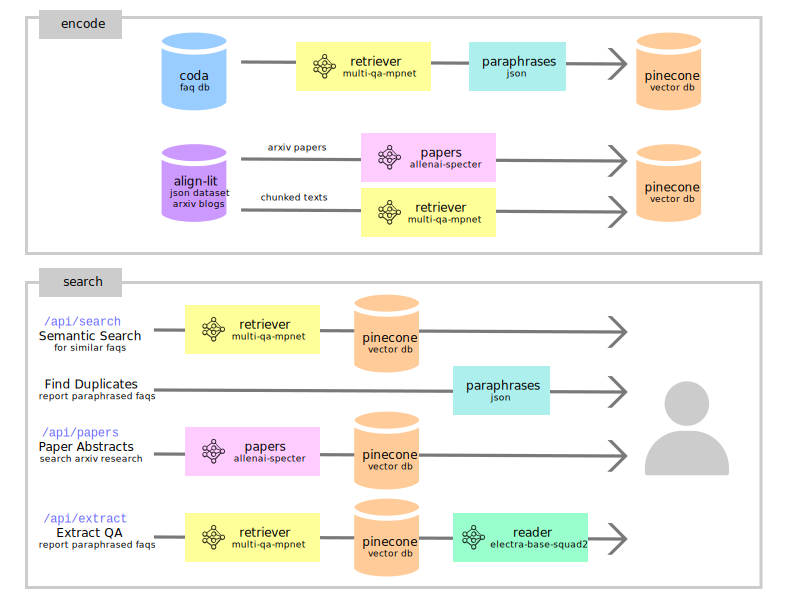

Stampy NLP performs semantic search and other NLP microservices for [aisafety.info](https://aisafety.info) and [stampy.ai](https://stampy.ai), a database of questions and answers about AGI safety. Contributions will be welcome (once I get the messy things cleaned up), and the code is released under the MIT License.

The demo url is [nlp.stampy.ai](https://nlp.stampy.ai/) or direct link to [stampy-nlp-t6p37v2uia-uw.a.run.app](https://stampy-nlp-t6p37v2uia-uw.a.run.app/). If you're interested in learning more about Natural Language Processing (NLP) and Transformers, the [HuggingFace course](https://huggingface.co/course/chapter1/2?fw=pt) provides an excellent introduction.

# Main Services Overview



Our NLP services offer 4 features which depend on 2 key components:

1. Three NLP models from HuggingFace, specifically [SentenceTransformers](https://www.sbert.net/), provide pre-trained models optimized for different types of semantic searches by generating sentence embeddings -- 768-dimension vectors, numerical representations that capture the meaning of the text. Think of it as an 768 element array of floats. In general, we use Python + PyTorch since that gives us the most flexibility to use a variety of models by default.

- Retriever model ([multi-qa-mpnet](https://huggingface.co/sentence-transformers/multi-qa-mpnet-base-cos-v1)) for identifying paraphrased questions.
- [allenai-specter](https://huggingface.co/sentence-transformers/allenai-specter) for searching titles & abstracts of scientific publications.
- Reader model ([electra-base-squad2](https://huggingface.co/deepset/electra-base-squad2)) finds the start & end index of the answer given a question and a context paragraph containing the answer.

2. [Pinecone](https://www.pinecone.io/) is a fully managed, high-performance database for vector search applications. Each data element contains the 768-dimension vector, a unique id (i.e. Coda id for our FAQ) and some metadata (original text, url, other relevant information).

## 1. [Semantic Search for Similar FAQs](https://nlp.stampy.ai/)

Encodes a given `query` string, sends the vector embedding to search pinecone for nearest entries in `faq-titles` namespace, then returns payload as json sorted by score between 0 and 1 indicating the similarity of match.

Sample API usage:

```text
https://nlp.stampy.ai/api/search?query=What+AI+safety%3F`
```

- `query` (required) is the sentence or phrase to be encoded then have nearest entries returned.
- `top` (optional) indicates the number of entries returned. If the value is not specified, the default is to return the 10 nearest entries.
- `showLive=0` (optional) will return only entries with `status` that are NOT "Live on site". The default is `showLive=1` to return only entries that with `status` that are "Live on site".
- `status=all` (optional) returns all entries including those that have not yet been canonically answered. Specify multiple values for `status` to return matching more than one value.

Additional usages:

`showLive=1` returns entries where `status == "Live on site"`

```bash
https://stampy-nlp-t6p37v2uia-uw.a.run.app/api/search?query=What+AI+safety%3F&showLive=1
```

`showLive=0` returns entries where `status != "Live on site"`

```bash
https://stampy-nlp-t6p37v2uia-uw.a.run.app/api/search?query=What+AI+safety%3F&showLive=0
```

`status=all` returns all questions regardless of status

```bash
https://stampy-nlp-t6p37v2uia-uw.a.run.app/api/search?query=Something+random%3F&status=all
```

`status=value` returns entries with status matching whatever value is specified. Multiple values may be listed separately. The example below returns entries with `status == "Not started"` and also `status == "In progress"`

```bash
https://stampy-nlp-t6p37v2uia-uw.a.run.app/api/search?query=Something+random%3F&status=Not%20started&status=In%20progress
```

## 2. [Duplicates Report](https://nlp.stampy.ai/duplicates)

Display a table with top pairs of most similar questions in Coda based on the last time `paraphrase_mining` was called.

## 3. [Literature Abstracts](https://nlp.stampy.ai/literature)

Encodes a given query string, sends the vector embedding to search pinecone for nearest entry in `paper-abstracts` namespace, then returns payload as json sorted by score between 0 and 1 indicating the similarity of match. In an effort to minimize the number of huge models in our app container, this service still uses the external HuggingFace API so it's still a bit slow.

Sample API usage:

```text
https://nlp.stampy.ai/api/literature?query=What+AI+safety%3F
```

## 4. [Extract QA](https://nlp.stampy.ai/extract)

Encodes a given query string then sends the vector embedding to search pinecone for the 10 nearest entries in `extracted-chunks` namespace. For each entry, run the HuggingFace pipeline task to extract the answer from each content then returns payload as json sorted by score between 0 and 1 indicating the confidence of the answer matches the query question. Since this runs +10 inferences, this can be rather slow.

Sample API usage:

```text
https://nlp.stampy.ai/api/extract?query=What+AI+safety%3F
```

# Setup Environment
## Install [Git Large File Storage](https://git-lfs.com)

After cloning this repo, the large Transformer models must be downloaded separately using `git lfs`.

### Linux

```bash
curl -s https://packagecloud.io/install/repositories/github/git-lfs/script.deb.sh | sudo bash
sudo apt-get install git-lfs
git lfs install
```

### MacOS

    brew install git-lfs

## Run the setup script

    ./setup.sh

If this is your first run, it will:
* download the appropriate models from Huggingface
* write the appropriate API keys/tokens to `.env`
* create a virtualenv
* install all requirements

Subsequent runs will skip bits that have already been done, but it does so by simply checking whether the appropriate files exist.
API tokens for [Coda](https://coda.io/account), [Pinecone](https://app.pinecone.io), [Hugging Face](https://huggingface.co/settings/tokens) are required,
but the script will ask you for them.

### Coda

The Stampy Coda table is `https://coda.io/d/_dfau7sl2hmG`

### Pinecone

When creating a Pinecone project, make sure that the environment is set to us-west1-gcp

### Duplicates generation

There is an `/api/encode-faq-titles` endpoint that will generate a duplicates file and save it to Cloud
Storage. To avoid misusage, the endpoint is password protected. The password is provided via the `AUTH_PASSWORD`
env variable. This is only used for that endpoint - if not set, the endpoint will simply return 401s.

# Deployment

## Install Google [Cloud SDK](https://cloud.google.com/sdk/docs/install)

### Linux
```bash
echo "deb [signed-by=/usr/share/keyrings/cloud.google.gpg] https://packages.cloud.google.com/apt cloud-sdk main" | sudo tee -a /etc/apt/sources.list.d/google-cloud-sdk.list
curl https://packages.cloud.google.com/apt/doc/apt-key.gpg | sudo apt-key --keyring /usr/share/keyrings/cloud.google.gpg add -
sudo apt-get update && sudo apt-get install google-cloud-cli
gcloud init
gcloud auth login --no-launch-browser
```

### MacOS

    brew install --cask google-cloud-sdk
    gcloud init

## Setup Docker

1. Install [Docker](https://docs.docker.com/get-docker/)
2. Authenticate Docker to Google Cloud: `gcloud auth configure-docker`

One thing worth remembering here is that Google Cloud Run containers assume that they'll get a Linux x64 image. The
deployment scripts should generate appropriate images, but it might be an issue if your deployments don't want to work
and you're not on a Linux x64 system

## Deploy to Google [Cloud Run](https://cloud.google.com/sdk/gcloud/reference/beta/run/deploy)

    ./deploy.sh <service name>

If no service name is provided, the script will deploy to `stampy-nlp`. Before actually doing anything, the script will
ask to make sure everything is correct.

# Files Overview

`main.py` is the main Flask server that responds to API endpoints and also displays web pages demonstrating the use of API calls.

Files named `encode_*.py` use the relevant model to encode the associated text then stores the results in a specific pinecone namespace that can be retrieved by the Flask server.

- `encode_faq_titles.py` encodes all the question titles from the Coda, then stores into pinecone `faq-titles` namespace for later use in Semantic Search for Similar FAQs on Stampy. Also uses the SentenceTransformer utility `paraphrase_mining` to generate a JSON file with top 100 pairs of most similar questions in Coda.

- `encode_extracted_chunks.py` takes alignment dataset (currently all ~1000 arxiv papers and ~2000 Alignment Forum blog posts), splits them into ~1000 word chunks split on complete sentences, encodes them, then stores into pinecone `extracted-chunks` namespace for later use in Extract QA.

- `encode_lit_abstracts.py` takes all arxiv papers from alignment dataset, encodes the title + abstracts, then stored into pinecone `lit-abstracts` namespace for later use in Paper Search.

# Discussion + Needs

## 1. Automate Deployment

Right now all this is deployed on Google Cloud Run, which allows all the dependencies to be containerized, supposedly starts up instantaneously and should scale to meet increased demand. Each of the HuggingFace NLP models are ~400 MB and we use 3 separate ones. Originally, to keep the app size small, I used the external Hugging Face API but it was very slow. To speed up inference, the transformer models are now packaged as part of the Cloud Run container, but that also means the app requires at least 4GB of memory to run as one "monolith." I believe this approach has addressed the latency issue for now. There are some recommendations to split the 3 models' functions into separate microservices which can run and scale independently, which is something I was planning to try next. Thoughts on other options?

## 2. Keep Code Databases Synchronized

Currently, a script is manually run to synchronize the list of questions in Coda to pinecone. Consider adding `/api/create` and `/api/delete` endpoints which take a Coda document id, synchronize data for the given entry in pinecone.

```text
https://nlp.stampy.ai/api/create?id=i-7dc3df6cd1e28f067c354042b0276673117624195a0adae01f83e34fbd2be652
https://nlp.stampy.ai/api/delete?id=...
```

## 3. Keep Alignment Dataset Up-to-Date

At the moment pinecone is free up to 1 million vectors, of which we are using ~40,000 vectors. It seems very responsive but there may be a price increase of we index the entire alignment literature dataset. It'd been nice to have someone who can do a cleaner parse of the [alignment dataset](https://github.com/moirage/alignment-research-dataset) and also Stampy's FAQ to extract the plain text from blogs, pdfs and other documents and keep alignment-related literature up-to-date with newly published arxiv papers and blog-posts. Also consider adding generated summaries of blog posts and treat like paper abstracts to expand paper search space.

## 4. Clean Up Code

Before all the above... The messy code needs to be cleaned up & refactored before getting others to contribute. I'm always open to suggestions in general!
